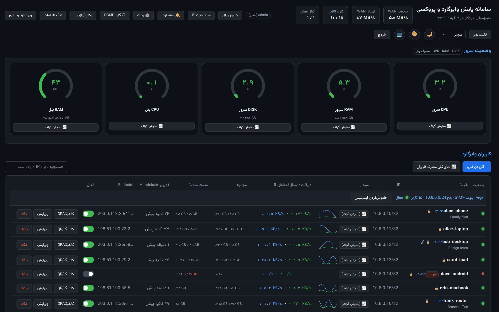
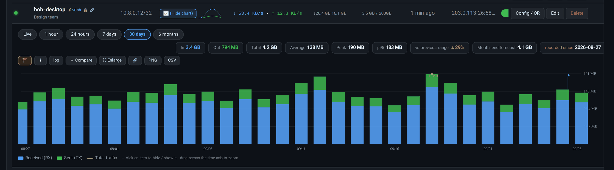
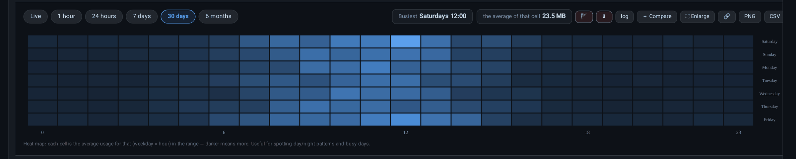
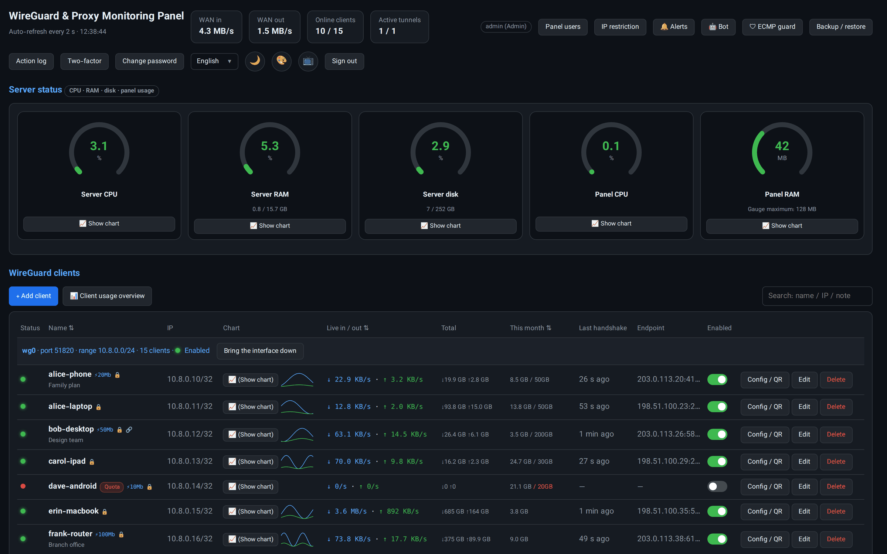
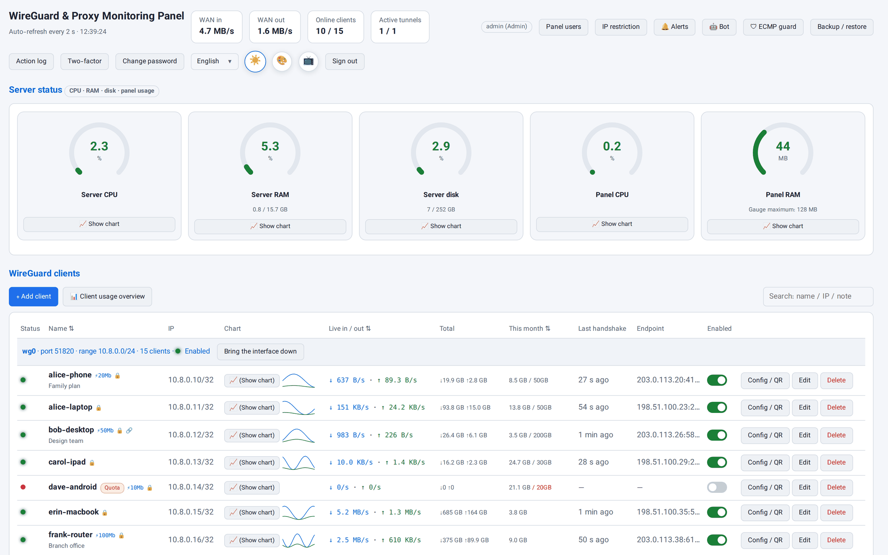
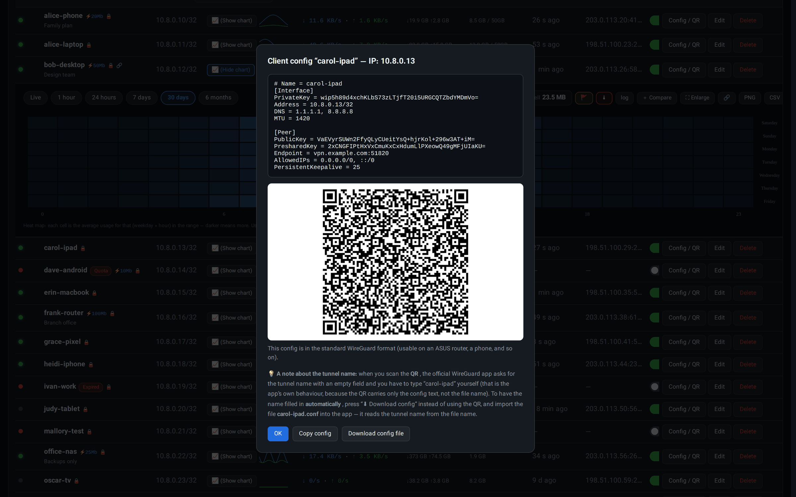
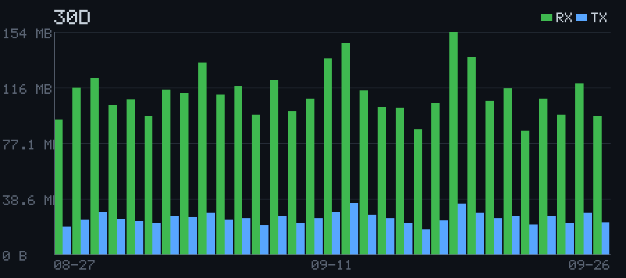
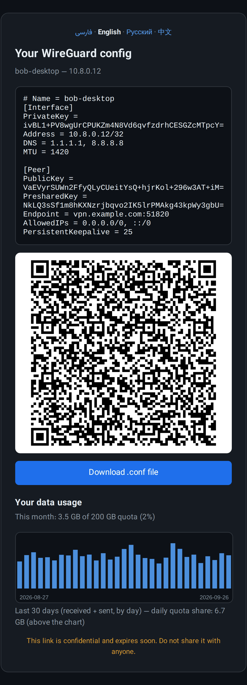

<div align="center">

# WG-PROXY-PANEL

**پنلِ تحتِ وبِ تک‌فایلی برای پایش و مدیریتِ WireGuard و پروکسیِ Squid.**<br>
فقط کتابخانه‌ی استانداردِ پایتون — بدونِ بسته‌ی pip، بدونِ مرحله‌ی build، با چهار زبان.

[](https://github.com/alibakhtiari-ux/WG-PROXY-PANEL/actions/workflows/verify.yml)
[](LICENSE)


[English](README.md) · **فارسی** · [Русский](README.ru.md) · [中文](README.zh-CN.md)

</div>

---

کلِ برنامه یک فایل است، `wg_panel.py`، و **جز کتابخانه‌ی استانداردِ پایتون**
به هیچ چیزی نیاز ندارد. آن را به‌صورتِ سرویسِ systemd (یا در کانتینرِ Docker ِ
همراهِ پروژه) اجرا کنید تا یک پنلِ وب برای اینترفیس‌های WireGuard ِ همان سرور
داشته باشید: ترافیکِ زنده‌ی هر کاربر، افزودن و غیرفعال‌کردنِ کاربر، کدِ QR و
لینکِ اشتراک، محدودیتِ سرعت و حجم، نمودارهای حرفه‌ای، بکاپ، تاریخچه‌ی
تغییرات، رباتِ تلگرامِ پیشرفته و متریک‌های Prometheus.

این پنل برای سروری ساخته شده که نه Docker دارد نه pip؛ پس نصبِ آن یعنی
کپی‌کردنِ یک فایل.

<p align="center">
  
</p>
<p align="center"><sub>همه‌ی تصاویرِ این صفحه داده‌ی ساختگیِ نمایشی دارند — بخشِ <a href="#screenshots">تصاویر</a> را ببینید.</sub></p>

## فهرست

- [تصاویر](#screenshots)
- [امکانات](#features)
- [موتورِ نمودار](#chart-engine)
- [زبان‌ها](#languages)
- [پیش‌نیازها](#requirements)
- [شروعِ سریع با Docker](#quick-start-with-docker)
- [نصب با systemd](#install-with-systemd)
- [به‌روزرسانی](#upgrading)
- [پیکربندی](#configuration)
- [Prometheus](#prometheus)
- [امنیت](#security)
- [رفعِ اشکال](#troubleshooting)
- [توسعه](#development)
- [ساختارِ مخزن](#repository-layout)
- [مشارکت](#contributing)
- [حمایت از پروژه](#support)
- [مجوز](#license)

<a id="screenshots"></a>

## تصاویر

<table>
  <tr>
    <td width="50%" valign="top">
      <a href="docs/screenshots/client-chart.png"></a>
      <p align="center"><b>نمودارِ ترافیکِ هر کاربر</b><br><sub>مصرفِ روزانه‌ی ۳۰ روز با میانگین، اوج، p95، مقایسه با بازه‌ی قبل و پیش‌بینیِ آخرِ ماه</sub></p>
    </td>
    <td width="50%" valign="top">
      <a href="docs/screenshots/heatmap.png"></a>
      <p align="center"><b>نقشه‌ی حرارتیِ روزِ هفته × ساعت</b><br><sub>کاربر چه زمانی از اتصال استفاده می‌کند، و پرترافیک‌ترین ساعتش</sub></p>
    </td>
  </tr>
  <tr>
    <td width="50%" valign="top">
      <a href="docs/screenshots/overview.png"></a>
      <p align="center"><b>انگلیسی، چپ‌به‌راست</b><br><sub>همان پنل به انگلیسی — یکی از چهار زبانِ رابط</sub></p>
    </td>
    <td width="50%" valign="top">
      <a href="docs/screenshots/light.png"></a>
      <p align="center"><b>تمِ روشن</b><br><sub>تمِ تیره و روشن، با یک دکمه در نوارِ بالا</sub></p>
    </td>
  </tr>
  <tr>
    <td width="50%" valign="top">
      <a href="docs/screenshots/config-qr.png"></a>
      <p align="center"><b>کانفیگ و کدِ QR ِ کاربر</b><br><sub>کپی کنید، فایلِ <code>.conf</code> را دانلود کنید یا QR را اسکن کنید</sub></p>
    </td>
    <td width="50%" valign="top">
      <a href="docs/screenshots/telegram-chart.png"></a>
      <p align="center"><b>نمودار از رباتِ تلگرام</b><br><sub>ربات خودش PNG را می‌کشد، با پایتونِ خالص</sub></p>
    </td>
  </tr>
</table>

<p align="center">
  <a href="docs/screenshots/share-mobile.png"></a><br>
  <b>صفحه‌ی اشتراک روی گوشی</b><br><sub>آنچه گیرنده‌ی لینکِ اشتراک می‌بیند: کانفیگ، کدِ QR، دکمه‌ی دانلود و مصرفِ خودش</sub>
</p>

> [!NOTE]
> این تصاویر از یک پنلِ واقعیِ در حالِ اجرا گرفته شده‌اند که با **داده‌ی
> ساختگی** پر شده است: نام‌های ساختگی برای کاربران، کلیدهای تولیدشده، دامنه‌ی
> نمونه‌ی `vpn.example.com` و آدرس‌های IP از بازه‌های مستندسازیِ RFC 5737. هیچ
> سرور، کاربر یا کلیدِ واقعی‌ای در آن‌ها نیست. همه‌شان با
> `python3 demo/screenshots.py` از نو ساخته می‌شوند.

<a id="features"></a>

## امکانات

### محدودیتِ سرعت و حجم برای هر کاربرِ WireGuard

- **محدودیتِ سرعت برای هر کاربر** بر حسبِ مگابیت‌برثانیه، که در خودِ کرنلِ
  لینوکس با `tc htb` اعمال می‌شود — دانلود روی خودِ اینترفیسِ WireGuard و آپلود
  از طریقِ یک دستگاهِ `ifb` محدود می‌شود. کاملاً اختیاری است: تا وقتی کسی را
  محدود نکرده‌اید، پنل اصلاً به `tc` دست نمی‌زند و کاربرانِ بدونِ محدودیت هیچ
  اثری نمی‌بینند.
- **سهمیه‌ی حجمِ ماهانه**، **سقفِ حجمِ کل** و **تاریخِ انقضا** برای هر کاربر.
- وقتی کاربر به یکی از این سقف‌ها برسد، پنل خودش اقدام می‌کند: کاربر را
  **غیرفعال** (پیش‌فرض) یا **حذف** می‌کند، رویداد را در تاریخچه ثبت می‌کند و
  هشدارِ تلگرام می‌فرستد. حساب‌هایی که به انقضا نزدیک‌اند (به‌طورِ پیش‌فرض ۳
  روز مانده) هم گزارش می‌شوند.
- کاربرانِ پروکسیِ Squid هم همین امکانات را دارند: سهمیه، محدودیتِ سرعت و
  تاریخِ انقضا.

### نمودارهای حرفه‌ای

- موتورِ نمودارِ اختصاصی روی canvas، بدونِ هیچ کتابخانه‌ی نمودار: نمودارِ خطی
  و میله‌ای روی محورِ زمانِ واقعی، **زوم**، **مقیاسِ لگاریتمی**، نمایشِ وقفه در
  جاهایی که داده نیست، نمایشِ مقدار با نگه‌داشتنِ ماوس، روشن و خاموش‌کردنِ هر
  سری، و نمای تمام‌صفحه
- بازه‌های زمانی: **زنده، ۱ ساعت، ۲۴ ساعت، ۷ روز، ۳۰ روز و ۶ ماه**
- نمودارِ ترافیک برای هر کاربر، هر اینترفیس و هر تونلِ خروجی
- **نقشه‌ی حرارتیِ «روزِ هفته × ساعت»** که نشان می‌دهد هر کاربر چه زمانی از
  اتصال استفاده می‌کند
- گیج‌های زنده‌ی CPU، حافظه و دیسک؛ نمودارِ تأخیر و مسیریابیِ WARP
- نمودارِ مصرف در هر صفحه‌ی اشتراک، تا خودِ کاربر مصرفش را ببیند

چطور کار می‌کند و چه کارهایی می‌کند: [موتورِ نمودار](#chart-engine).

### رباتِ تلگرامِ پیشرفته

ربات داخلِ همان پروسه‌ی پنل اجرا می‌شود و سرویسِ جداگانه‌ای لازم ندارد. یک راهِ
دومِ کامل برای مدیریتِ سرور است — بدونِ SSH و بدونِ مرورگر:

- **۱۸ دستور** و منوی دکمه‌ای: ساختن، نمایش، تغییرِ نام، فعال/غیرفعال‌کردن و
  حذفِ کاربرانِ WireGuard و پروکسی؛ تعیینِ **سهمیه** و **محدودیتِ سرعت**؛
  فرستادنِ **فایلِ کانفیگ** و **کدِ QR**
- **نمودار به‌صورتِ تصویر** — ربات خودش فایلِ PNG را می‌کشد (پایتونِ خالص، بدونِ
  کتابخانه‌ی تصویر): ترافیکِ هر کاربر (۲۴ ساعت / ۷ روز / ۳۰ روز / ۶ ماه)،
  ترافیکِ پروکسی و تستِ سرعت، همراه با مجموع، میانگین و بیشینه در توضیحِ تصویر
- کاربرانِ آنلاین، جست‌وجو، گزارش بر اساسِ انقضا و بر اساسِ مصرف، وضعیتِ بکاپ،
  تستِ سرعت، و خلاصه‌ی روزانه یا هفتگی
- **۱۲ نوع هشدار**: قطع و وصلِ تونل‌های خروجی، رسیدن به سهمیه، نزدیک‌شدنِ
  انقضا، بالا بودنِ CPU/RAM/دیسک، مصرفِ swap، تلاش‌های ناموفقِ مکررِ ورود،
  شکستِ آپلودِ بکاپ، افتِ سرعت، ری‌استارتِ پنل و موارد دیگر
- **تأییدِ ورود به پنل** با یک لمس در تلگرام (اختیاری)
- نقش برای کاربرانِ ربات (`owner`، `admin`، `viewer`) و زبانِ جداگانه برای هر چت

### امکاناتِ دیگر

**کاربران**

- وضعیتِ آنلاین/آفلاین از روی زمانِ آخرین هندشیک، و ترافیکِ زنده‌ی دریافت و
  ارسالِ هر کاربر (نمونه‌برداری هر ۲ ثانیه)
- افزودنِ کاربر (ساختِ جفت‌کلید و انتخابِ یک آدرسِ آزاد از بازه) و حذفِ کاربر
- فعال یا غیرفعال‌کردنِ کاربر هم روی اینترفیسِ زنده **و** هم در فایلِ کانفیگ،
  تا تغییر پس از ری‌استارت هم بماند
- کانفیگِ آماده‌ی کاربر با دکمه‌ی کپی، دانلود و کدِ QR
- **لینکِ اشتراک** — صفحه‌ای مستقل با کدِ QR، دکمه‌ی دانلود و نمودارِ مصرف،
  برای فرستادنِ کانفیگ به دیگران. اعتبارِ لینک از ۱ دقیقه تا ۲۴ ساعت است،
  می‌تواند یک‌بارمصرف باشد و قابلِ لغو است. زبانِ صفحه از مرورگرِ گیرنده
  انتخاب می‌شود.

**سرور**

- وضعیتِ تونل‌های خروجی: endpoint، سرعتِ زنده و وضعیتِ یونیتِ systemd
- پشتیبانی از اینترفیس‌های WireGuard و AmneziaWG
- مدیریتِ کاربرانِ پروکسیِ Squid
- وضعیتِ Cloudflare WARP، و یک سرویسِ اختیاریِ تفکیکِ SNI که اتصال‌ها را بر
  اساسِ نامِ میزبانِ مقصد مسیردهی می‌کند
- ممیزیِ نشتِ فقط‌خواندنی (مسیریابی؛ و DNS و IPv6 از طریقِ رباتِ تلگرام)
- بکاپ و بازیابی؛ هر فایلِ کانفیگ پیش از نوشتن خودکار بکاپ گرفته می‌شود و
  نوشتن اتمیک است
- تاریخچه‌ی همه‌ی کارها: چه کسی، چه کاری، با چه نتیجه‌ای
- نمای تلویزیون/کیوسک که صفحه‌های وضعیت را به‌نوبت نشان می‌دهد، همراه با یک
  نمای سه‌بعدیِ شبکه

**دسترسی**

- چند کاربر؛ نقش‌های داخلیِ `admin` و `viewer` به‌علاوه‌ی نقش‌های سفارشی که از
  فهرستی از مجوزهای جزئی ساخته می‌شوند
- ورودِ دومرحله‌ایِ اختیاری با TOTP، و تأییدِ اختیاریِ هر ورود به پنل از
  طریقِ تلگرام
- کوکیِ نشستِ امضاشده، محدودیتِ تعدادِ تلاشِ ورود، فهرستِ مجازِ IP (اختیاری)
- متریک‌های Prometheus در `/metrics`، محافظت‌شده با توکنِ Bearer

<a id="chart-engine"></a>

## موتورِ نمودار

همه‌ی نمودارهای پنل را یک موتورِ رسمِ کوچک می‌کشد که برای همین پروژه از صفر
نوشته شده است: Canvas 2D ِ خالص، در حدودِ دو هزار خط JavaScript داخلِ
`wg_panel.py`. هیچ کتابخانه‌ی نمودار و هیچ CDN‌ای در کار نیست، پس روی سرورِ
بدونِ اینترنت هم کار می‌کند. موتور داده‌ای را که می‌کشد می‌شناسد: می‌داند
سهمیه چیست، کاربر کِی غیرفعال شده و یک تونل در ده ثانیه‌ی گذشته چند بایت
جابه‌جا کرده است.

### چه چیزهایی می‌کشد

| نمودار | کجا | چه نشان می‌دهد |
|---|---|---|
| ترافیک | هر کاربر، هر اینترفیس و هر تونلِ خروجی | دریافت و ارسال به‌علاوه‌ی یک خطِ خط‌چینِ مجموع؛ برای «زنده» و «۱ ساعت» خطی، از ۲۴ ساعت به بالا میله‌ای |
| نقشه‌ی حرارتی | هر نمودارِ ترافیک، بازه‌ی ۷ یا ۳۰ روز | میانگینِ مصرف در هر ساعت از هر روزِ هفته، و پرترافیک‌ترین ساعت |
| تفکیکِ کاربران | هر اینترفیسِ WireGuard | سهمِ هر کاربر از ترافیکِ اینترفیس: ۷ کاربرِ اول، و بقیه با هم زیرِ «سایر» |
| مقایسه | هر مجموعه‌ای از نمودارها که انتخاب کنید | چند کاربر، تونل یا اینترفیس به‌صورتِ خط روی یک محورِ مشترک |
| نمای کلی مصرف | بخشِ کاربرانِ وایرگارد | مصرفِ انباشته‌ی همه‌ی کاربرانِ یک اینترفیس در طولِ زمان |
| گیج‌های سرور | CPU، RAM، دیسک، CPU و RAM ِ پنل | تاریخچه‌ی پشتِ هر گیج |
| تستِ سرعت | بخشِ تستِ سرعت | دانلود و آپلود به Mbit/s، و پینگ روی محورِ دوم |
| WARP | بخشِ WARP | زمانِ پاسخ در مسیرِ مستقیم در برابرِ WARP، و سهمِ ترافیکی که به سرویس‌های هوشِ مصنوعی می‌رود |
| کیفیتِ مسیر | تشخیصِ مسیرِ سرویس‌ها | کیفیتِ تماس (MOS) و زمانِ رفت‌وبرگشت برای هر مسیرِ سنجیده‌شده |
| صفحه‌ی اشتراک | صفحه‌ای که لینکِ اشتراک باز می‌کند | مصرفِ ۳۰ روزِ اخیرِ خودِ گیرنده، و اگر سهمیه دارد، سهمِ روزانه‌اش |

### عددها از کجا می‌آیند

| بازه | هر نقطه یعنی | نگهداری |
|---|---|---|
| زنده | یک نمونه‌ی ۲ ثانیه‌ای | ۳ دقیقه‌ی اخیر، در حافظه |
| ۱ ساعت | میانگینِ ۱۰ ثانیه | یک ساعتِ اخیر، در حافظه (با ری‌استارت از نو شروع می‌شود) |
| ۲۴ ساعت | یک ساعت | حدودِ ۲۱ روز، در SQLite |
| ۷ روز · ۳۰ روز · ۶ ماه | یک روز | حدودِ ۴۰۰ روز، در SQLite؛ نمای ۶ ماه می‌تواند روزها را هفتگی جمع کند |

مصرفِ کاربرانِ پروکسی از لاگِ دسترسیِ Squid حساب می‌شود و از نمای ۲۴ ساعت
شروع می‌شود. نقشه‌ی حرارتی از ردیف‌های ساعتی ساخته می‌شود، پس تا حدودِ ۲۱ روز
به عقب را می‌بیند.

### عددهای بالای هر نمودار

- **دریافت، ارسال، مجموع**: در «زنده» و «۱ ساعت» سرعتِ همین لحظه؛ در
  بازه‌های بلندتر جمعِ کلِ بازه.
- **میانگین** و **اوج**، و **p95**: مقداری که ۹۵٪ ِ ساعت‌ها یا روزهای بازه
  زیرِ آن می‌مانند. به همین دلیل یک جهشِ تکی بر آن غالب نمی‌شود.
- **نسبت به بازه قبل**: تغییر نسبت به دوره‌ی هم‌طولِ درست قبل از آن. ▲ ِ
  کهربایی یعنی بیشتر، ▼ ِ سبز یعنی کمتر.
- **پیش‌بینی پایان ماه**، برای کاربرانِ دارای سهمیه‌ی ماهانه. مصرفِ ماه تا
  امروز را روی کلِ ماه پخش می‌کند، و اگر آهنگِ مصرف زیاد باشد هشدارِ «~N روز
  تا اتمام سهمیه» می‌دهد.
- **ثبت‌شده از**: اولین روزی که داده دارد، تا تاریخچه‌ی کوتاه با مصرفِ کم
  اشتباه گرفته نشود.

روی خودِ نمودار، یک نقطه‌ی طلایی اوج را نشان می‌دهد، و برای کاربرانِ دارای
سهمیه یک خطِ خط‌چین در ارتفاعِ سهمِ روزانه‌ی آن کشیده می‌شود.

### کار با نمودار

- **نگه‌داشتنِ نشانگر** روی نمودار همه‌ی سری‌ها را در همان لحظه نشان می‌دهد.
  اگر چند نمودار باز باشد، همه همان لحظه را دنبال می‌کنند.
- **زوم**: روی نمودار بکشید تا یک بازه‌ی زمانی انتخاب شود، یا از چرخِ ماوس
  استفاده کنید. روی گوشی، با دو انگشت باز و بسته کنید. وقتی زوم شده است،
  کشیدن نمودار را روی محورِ زمان جابه‌جا می‌کند. دوبار کلیک یا **↺ کل بازه**
  زوم را برمی‌دارد. محورِ عمودی خودش را با بخشِ دیده‌شده تنظیم می‌کند.
- **کلیک روی هر آیتمِ راهنما** آن سری را پنهان یا آشکار می‌کند.
- **log** مقیاس را لگاریتمی می‌کند تا یک کاربرِ کم‌مصرف و یک کاربرِ پرمصرف
  روی یک نمودار خوانا باشند.
- **🚩** تغییراتِ ثبت‌شده در تاریخچه را روی محورِ زمان علامت می‌زند: قرمز
  وقتی کاربری غیرفعال یا تونلی قطع می‌شود، سبز وقتی چیزی برمی‌گردد، آبی برای
  بقیه‌ی تغییرات. روی نمودارِ تونل، مدتِ قطعی هم با سایه‌ی قرمز مشخص می‌شود.
  با بردنِ نشانگر نزدیکِ پرچم می‌بینید چه شد، چه کسی انجامش داد و چرا.
  نمودارِ اینترفیسِ WARP رویدادهای خودِ WARP را هم نشان می‌دهد، مثلِ سوییچ
  به کلیدِ استندبای.
- **⛶ بزرگ‌نمایی** نمودار را تمام‌صفحه باز می‌کند و **＋ مقایسه** آن را به
  مقایسه اضافه می‌کند.
- **🔗** لینکِ دقیقاً همین نما را کپی می‌کند: همین نمودار، بازه، زوم، و حالتِ
  لگاریتمی، حرارتی یا تفکیکِ کاربران.
- **PNG** نمودار را با وضوحِ کاملِ صفحه و عنوانش ذخیره می‌کند. **CSV**
  ردیف‌های خام را با UTF-8 ذخیره می‌کند، آماده برای صفحه‌گسترده.

بازه، مقیاس و سری‌های پنهانِ هر نمودارِ باز در مرورگر به خاطر سپرده می‌شوند.

### صادق، از پایه

- از نمای ۱ ساعت به بالا، محورِ زمان زمانِ واقعی است: ساعتی که داده ندارد
  خالی می‌ماند، و جایی که داده نیست خط قطع می‌شود، نه اینکه از رویِ جای خالی
  رد شود.
- در نمای ۱ ساعت، کاربرِ ساکت یک خطِ صفرِ واقعی است، نه جای خالی: پنل سکوت را
  هم ثبت می‌کند.
- محورها با گام‌های گرد (۱، ۲، ۲٫۵ یا ۵ × ۱۰ⁿ) درجه‌بندی می‌شوند و بایت‌ها
  با توان‌های ۱۰۲۴. سرعت‌ها بایت بر ثانیه‌اند؛ تستِ سرعت به Mbit/s است.
- نمودارها با تراکمِ پیکسلِ واقعیِ صفحه کشیده می‌شوند، پس روی نمایشگرهای
  پرتراکم هم تیز می‌مانند، و با تغییرِ اندازه‌ی پنجره از نو کشیده می‌شوند.
- داده هر ۲ ثانیه تازه می‌شود، ولی وقتی نشانگر روی نمودار است مکث می‌کند تا
  نمودار زیرِ دستتان جابه‌جا نشود.

### رنگ‌ها و زبان‌ها

نمودارها رنگشان را از تمِ صفحه می‌گیرند، پس با تمِ تیره و روشن هماهنگ‌اند.
دکمه‌ی **🎨** یک پالتِ مناسبِ کوررنگی (Okabe–Ito) را روشن می‌کند، که در آن
خطِ ارسال خط‌چین هم می‌شود تا سری‌ها علاوه بر رنگ، در شکل هم فرق داشته
باشند. در زبانِ فارسی نمودارها ارقامِ فارسی دارند، و نمودارهای تستِ سرعت،
کیفیتِ مسیر و WARP تاریخ را به تقویمِ شمسی نشان می‌دهند.

### نمودار در تلگرام

رباتِ تلگرام مرورگر ندارد، پس پنل نمودار را روی خودِ سرور هم می‌کشد، با
پایتونِ خالص. یک بافرِ پیکسلی را پر می‌کند، خط‌ها و میله‌ها را در آن می‌کشد،
برچسب‌ها را با یک فونتِ بیت‌مپیِ داخلی می‌نویسد، و نتیجه را با `zlib` در یک
PNG بسته‌بندی می‌کند. تصویر ۹۰۰ × ۴۰۰ است، میله‌ای یا خطی. همین تصاویر در
نمودارهای کاربر و پروکسیِ ربات و در گزارشِ دوره‌ای فرستاده می‌شوند.

<a id="languages"></a>

## زبان‌ها

پنل، تاریخچه‌ی تغییرات، پیام‌های خطای API، رباتِ تلگرام و هشدارهای تلگرام
همگی به **انگلیسی، فارسی، روسی و چینی** در دسترس‌اند. ترجمه‌ها داخلِ خودِ
`wg_panel.py` هستند (حدودِ دو هزار کلید)، تا پنل همچنان یک فایل بماند.

| کجا | زبان چگونه انتخاب می‌شود |
|---|---|
| پنل، صفحه‌ی ورود، صفحه‌ی اشتراک | `?lang=` ← کوکیِ `wgl` ← `Accept-Language` ِ مرورگر ← فارسی |
| رباتِ تلگرام | جدا برای هر چت — هر کاربر با `/lang` انتخاب می‌کند |
| هشدارهای تلگرام | زبانِ مالکِ ربات |

صفحه‌های فارسی راست‌به‌چپ و بقیه چپ‌به‌راست‌اند؛ استایل‌ها با ویژگی‌های
منطقیِ CSS نوشته شده‌اند، پس چیدمان خودش آینه می‌شود. ارقامِ فارسی فقط در زبانِ
فارسی به کار می‌روند. شناسه‌ها — نامِ کاربر، کلید، endpoint، آدرسِ IP — در همه‌ی
زبان‌ها لاتین می‌مانند تا قابلِ جست‌وجو و کپی باشند.

فونتِ جاسازی‌شده‌ی وزیرمتن فارسی و لاتین را پوشش می‌دهد؛ روسی و چینی از فونتِ
سیستم استفاده می‌کنند. هیچ چیزی از CDN بارگذاری نمی‌شود، پس پنل روی سرورِ
بدونِ اینترنت هم کار می‌کند.

<a id="requirements"></a>

## پیش‌نیازها

- اوبونتو 22.04 یا 24.04 ‏(x86_64 یا arm64) با دسترسیِ root
- پایتونِ 3.10 یا جدیدتر از خودِ توزیع — بدونِ بسته‌ی pip و بدونِ virtualenv
- بسته‌ی `wireguard-tools`

> [!NOTE]
> این پنل اینترفیس‌های WireGuard را مدیریت می‌کند؛ توپولوژیِ شبکه‌ی شما را
> طراحی نمی‌کند. نصب با Docker یک اینترفیس برایتان می‌سازد. در نصب با systemd،
> پنل همان اینترفیس‌هایی را مدیریت می‌کند که از قبل روی سرور هستند.

<a id="quick-start-with-docker"></a>

## شروعِ سریع با Docker

پنل و WireGuard در یک کانتینر اجرا می‌شوند. اولین اجرا `config.json`، کلیدهای
سرور و یک گواهیِ TLS ِ خودامضا را می‌سازد؛ اجراهای بعدی فقط کدِ پنل را به‌روز
می‌کنند و به داده‌های شما دست نمی‌زنند.

```bash
git clone https://github.com/alibakhtiari-ux/WG-PROXY-PANEL.git
cd WG-PROXY-PANEL/docker
sudo bash host-setup.sh
(umask 077 && cp .env.example .env)
```

فایلِ `.env` را باز کنید و دست‌کم `WG_SERVER_HOST` را تنظیم کنید — آدرسِ IP ِ
عمومی یا دامنه‌ای که کاربران به آن وصل می‌شوند. سپس:

```bash
docker compose up -d --build
```

پنل روی `https://SERVER:8787` با گواهیِ خودامضا بالا می‌آید (هشدارِ مرورگر را
یک بار بپذیرید). نامِ کاربری `admin` است.

> [!WARNING]
> **اولین رمزی که وارد کنید، رمزِ مدیر می‌شود.** بلافاصله بعد از نصب وارد
> شوید، پیش از آنکه کسِ دیگری به پورتِ 8787 دسترسی پیدا کند.

برای سرورهای بدونِ اینترنت، می‌توانید یک بسته‌ی آفلاین روی ماشینی که اینترنت
دارد بسازید و به سرور ببرید. از ریشه‌ی مخزن:

```bash
cd docker/airgap && bash build-offline-bundle.sh --arch amd64
```

جزئیات: [docker/README.md](docker/README.md) ·
[docker/airgap/README.md](docker/airgap/README.md)

<a id="install-with-systemd"></a>

## نصب با systemd

پنل و یونیتش را از [آخرین release](https://github.com/alibakhtiari-ux/WG-PROXY-PANEL/releases/latest) دانلود کنید و با checksumهای
منتشرشده بسنجید (کلون‌کردنِ مخزن هم کار می‌کند):

```bash
base=https://github.com/alibakhtiari-ux/WG-PROXY-PANEL/releases/latest/download
curl -fLO "$base/wg_panel.py" -O "$base/wg-panel.service" -O "$base/SHA256SUMS"
sha256sum -c SHA256SUMS
```

پنل پیکربندیِ خودش را **نمی‌سازد**: فایلِ `config.json` را از همان پوشه‌ای که
`wg_panel.py` در آن است می‌خوانَد و بدونِ آن اجرا نمی‌شود. فایل و یونیت را نصب
کنید:

```bash
sudo install -D -m600 -o root -g root wg_panel.py /opt/wg-panel/wg_panel.py
sudo install -m644 wg-panel.service /etc/systemd/system/
```

سپس فایلِ `/opt/wg-panel/config.json` را بسازید (مالک root، مجوزِ `600`). یک
نمونه‌ی حداقلی — با `salt` و `hash` ِ خالی، اولین ورود رمز را ثبت می‌کند؛ بدونِ
`tls_cert` و `tls_key` پنل روی HTTP ِ ساده اجرا می‌شود:

```json
{
  "port": 8787,
  "users": [{"username": "admin", "salt": "", "hash": "", "role": "admin"}],
  "server_host": "vpn.example.com",
  "client_dns": "1.1.1.1, 8.8.8.8",
  "client_mtu": 1420
}
```

```bash
sudo systemctl enable --now wg-panel
```

یونیت‌های اختیاری برای بکاپ، چرخشِ لاگ، محافظت در برابرِ OOM و قاعده‌ی fail2ban
در پوشه‌ی [deploy/](deploy/) هستند.

<a id="upgrading"></a>

## به‌روزرسانی

پنل یک فایل است، پس به‌روزرسانی یعنی جایگزین‌کردنِ همان فایل. تنظیماتِ
`config.json` و داده‌های `traffic.db` حفظ می‌شوند؛ پیکربندی‌های قدیمی‌تر هنگامِ
شروعِ پنل خودکار به‌روز می‌شوند.

**با systemd:** release ِ جدید را مثلِ بالا دانلود کنید، همراه با بررسیِ
`sha256sum -c`، سپس:

```bash
sudo install -m600 -o root -g root wg_panel.py /opt/wg-panel/wg_panel.py
sudo systemctl restart wg-panel
```

برای دیدنِ build ای که روی سرور اجرا می‌شود، خروجیِ
`sha256sum /opt/wg-panel/wg_panel.py | cut -c1-12` را با build id ِ یادداشتِ
release مقایسه کنید. تغییراتِ هر نسخه در [CHANGELOG.md](CHANGELOG.md) آمده است.

**با Docker:** کدِ جدید را روی سرور بیاورید (`git pull`)، سپس در پوشه‌ی
`docker/`:

```bash
docker compose up -d --build
```

> [!TIP]
> پیش از به‌روزرسانی بکاپ بگیرید — با دکمه‌ی **بکاپ/بازیابی** در پنل، یا با
> کپی‌گرفتن از `/opt/wg-panel/` (در Docker، `docker/data/`).

<a id="configuration"></a>

## پیکربندی

همه‌ی تنظیمات در `/opt/wg-panel/config.json` است و بیشترشان از داخلِ پنل هم
قابلِ تغییرند. کلیدهای مهم:

| کلید | کاربرد |
|---|---|
| `port` | پورتِ شنود (پیش‌فرض `8787`) |
| `tls_cert` · `tls_key` | مسیرِ گواهی و کلیدِ TLS؛ اگر نباشند HTTP ِ ساده |
| `users` | حساب‌های پنل (هشِ رمز با PBKDF2) و نقشِ هرکدام |
| `roles` | نقش‌های سفارشی و مجوزهایشان |
| `server_host` · `server_endpoint` | آدرسی که در کانفیگِ کاربران نوشته می‌شود |
| `client_dns` · `client_mtu` · `client_allowed` | مقادیرِ پیش‌فرضِ کانفیگِ کاربران |
| `allow_ips` | فهرستِ مجازِ IP، اختیاری (`127.0.0.1` همیشه مجاز است) |
| `metrics_token` | توکنِ Bearer برای `/metrics` |
| `bot` | توکنِ رباتِ تلگرام و کاربرانِ مجاز |
| `alerts` | هشدارهای تلگرام و آستانه‌هایشان |

<a id="prometheus"></a>

## Prometheus

```yaml
scrape_configs:
  - job_name: wg-panel
    scheme: https
    metrics_path: /metrics
    authorization:
      type: Bearer
      credentials: <metrics_token from config.json>
    static_configs:
      - targets: ['your-server:8787']
```

اگر گواهی خودامضاست، `tls_config: {insecure_skip_verify: true}` را اضافه کنید
یا گواهی را به Prometheus بدهید.

<a id="security"></a>

## امنیت

- سرویس با کاربرِ root اجرا می‌شود، چون اینترفیس‌های شبکه و قواعدِ فایروال را
  تغییر می‌دهد. فایل‌هایش مالکِ root و با مجوزِ `600` هستند.
- کلیدِ خصوصیِ کاربرانی که **خودِ پنل** ساخته در `/opt/wg-panel/clients/` (فقط
  root) نگه داشته می‌شود تا کانفیگ و QR بعداً هم قابلِ نمایش باشند.
- **لینکِ اشتراک کلیدِ خصوصیِ کاربر را در خود دارد.** عمرِ کوتاهی دارد، می‌تواند
  یک‌بارمصرف باشد و قابلِ لغو است، و با `Referrer-Policy: no-referrer` و
  `X-Robots-Tag: noindex` ارائه می‌شود — با این حال هر لینک را مثلِ یک رمز نگه
  دارید.
- ورود به ۵ تلاش در دقیقه برای هر IP محدود است و خطاهای پیاپی می‌توانند هشدارِ
  تلگرام بفرستند. فیلتر و قاعده‌ی fail2ban در `deploy/` هست.
- رباتِ تلگرام یک راهِ کاملِ مدیریت است: هر کسی که در فهرستِ کاربرانِ مجازِ
  آن باشد، بدونِ SSH و بدونِ ورود به پنل می‌تواند سرور را تغییر دهد.
- پنل را پشتِ `allow_ips` یا فایروال قرار دهید. در نصب با Docker توجه کنید که
  `ufw` پورت‌هایی را که Docker منتشر می‌کند فیلتر نمی‌کند — نگاه کنید به
  [docker/README.md](docker/README.md).

برای گزارشِ آسیب‌پذیری، [SECURITY.md](SECURITY.md) را ببینید.

<a id="troubleshooting"></a>

## رفعِ اشکال

<details>
<summary><b>رمزِ ادمین را فراموش کرده‌ام یا دستگاهِ ورودِ دومرحله‌ای را گم کرده‌ام</b></summary>

<br>

پنل را متوقف کنید و `config.json` را باز کنید (`/opt/wg-panel/config.json`، یا
در Docker `docker/data/panel/config.json`). حساب را در `users` پیدا کنید و
`salt` و `hash` آن را رشته‌ی خالی بگذارید — برای خاموش‌کردنِ ورودِ دومرحله‌ای ِ
آن حساب، `totp` را هم `""` کنید. پنل را دوباره اجرا کنید: اولین رمزی که برای
آن حساب در صفحه‌ی ورود وارد شود رمزِ جدیدش می‌شود؛ پس این کار را وقتی انجام
دهید که کسِ دیگری به پنل دسترسی ندارد.

</details>

<details>
<summary><b>سرویس اجرا نمی‌شود</b></summary>

<br>

لاگ را با `journalctl -u wg-panel -n 50` بخوانید. رایج‌ترین علت نبودن یا
نامعتبربودنِ `config.json` است: پنل هرگز این فایل را خودش نمی‌سازد (بخشِ
[نصب با systemd](#install-with-systemd) را ببینید) و باید JSON ِ معتبر باشد.

</details>

<details>
<summary><b>لینکِ اشتراک می‌گوید نامعتبر یا منقضی است</b></summary>

<br>

لینکِ اشتراک وقتی منقضی شود، اگر یک‌بارمصرف باشد پس از اولین استفاده، یا
وقتی لغو شود از کار می‌افتد. صفحه عمداً نمی‌گوید کدام‌یک رخ داده است. از ردیفِ
همان کاربر یک لینکِ تازه بسازید.

</details>

<details>
<summary><b>بعد از تغییرِ کد صفحه سفید است</b></summary>

<br>

تقریباً همیشه یعنی یک خطای JavaScript داخلِ رشته‌های پایتون — یادداشتِ بخشِ
[توسعه](#development) را ببینید و کنسولِ مرورگر را بررسی کنید.

</details>

<a id="development"></a>

## توسعه

فایلِ `wg_panel.py` بیش از ۳۰٬۰۰۰ خط دارد، و کلِ رابطِ وب (HTML، CSS و
JavaScript) داخلِ رشته‌های پایتون است. اجرای تست‌ها:

```bash
python3 -m unittest discover -s tests -v
python3 -m py_compile wg_panel.py
python3 tests/check_js.py      # نحوِ JavaScript، نیازمندِ Node.js
```

تست‌ها از جمله این‌ها را می‌سنجند: هر کلیدِ ترجمه در هر چهار زبان با
جای‌نگهدارهای یکسان وجود داشته باشد؛ متنِ ترجمه‌شده هرگز «داده» نشود (برچسبِ
متریک، ردیفِ ذخیره‌شده‌ی تاریخچه، کلیدِ مقایسه)؛ هیچ چیزِ خصوصی واردِ context ِ
بیلدِ Docker نشود؛ و داده‌های آزمایشی از آدرس‌های مستندسازیِ RFC 5737 استفاده
کنند. برخی تست‌ها در این مخزن رد (skip) می‌شوند، چون ابزارهای استقراری را
می‌سنجند که اینجا منتشر نشده‌اند.

> [!IMPORTANT]
> پایتون خطاهای داخلِ رشته‌های JavaScript را نمی‌بیند — `py_compile` روی
> JavaScript ِ خراب هم موفق می‌شود و نتیجه‌اش یک صفحه‌ی سفید در مرورگر است.
> `tests/check_js.py` (که CI هم اجرایش می‌کند) خطاهای نحوی را می‌گیرد؛ با این
> حال بعد از تغییرِ رابط، پنل را باز کنید و کنسولِ مرورگر را ببینید.

**حالتِ دمو.** `python3 demo/run.py` پنل را روی `http://127.0.0.1:8787` (کاربر
`admin`، رمز `demo`) با کاربرانِ ساختگی، شش ماه تاریخچه‌ی ترافیک و ابزارهای
سیستمیِ ساختگی بالا می‌آورد. نه WireGuard لازم دارد نه root، و بیرون از یک پوشه‌ی
موقت چیزی نمی‌نویسد. `python3 demo/screenshots.py` همه‌ی تصاویرِ
`docs/screenshots/` را از نو می‌سازد؛ Node.js و Playwright لازم دارد و اگر
Pillow نصب باشد تصاویر را فشرده می‌کند.

<a id="repository-layout"></a>

## ساختارِ مخزن

| مسیر | محتوا |
|---|---|
| `wg_panel.py` | کلِ برنامه |
| `wg-panel.service` | یونیتِ systemd |
| `docker/` | نصب با Docker Compose و سازنده‌ی بسته‌ی آفلاین |
| `deploy/` | یونیت‌های اختیاریِ systemd، قاعده‌ی fail2ban، اسکریپت‌های بکاپ، تفکیک‌کننده‌ی SNI |
| `tests/` | مجموعه‌ی تست‌ها |
| `docs/screenshots/` | تصاویرِ استفاده‌شده در READMEها |
| `demo/` | حالتِ دمو و سازنده‌ی اسکرین‌شات‌ها |
| `CHANGELOG.md` | تغییراتِ هر نسخه |
| `fonts/` | زیرمجموعه‌ی فونتِ وزیرمتن |
| `qr.js` · `three.*.min.js.gz` | کتابخانه‌های همراهِ کدِ QR و three.js |

<a id="contributing"></a>

## مشارکت

گزارشِ باگ و pull request خوشایند است — [CONTRIBUTING.md](CONTRIBUTING.md) را
ببینید. لطفاً دو قاعده‌ی پروژه را رعایت کنید: **فقط کتابخانه‌ی استاندارد** و
**یک فایل**.

<a id="support"></a>

## حمایت از پروژه

اگر این پنل برایتان مفید است، می‌توانید با کمکِ مالی از ادامه‌ی توسعه‌اش حمایت کنید:

**تتر** — USDT · TRON (TRC20)

```text
TV4R2i7yQxzEVSzZEXwBJqfhDavifaGwMt
```

**تتر یا USDC** — USDT / USDC · BNB Smart Chain (BEP20)

```text
0x5631398273a7283d543A62336eD090101FF3D449
```

**بیت‌کوین** — Bitcoin (BTC)

```text
bc1qjnmmqs5c57shld3ka90vcle4scxhszevehj4y3
```

> [!WARNING]
> هر ارز را **فقط روی همان شبکه‌ای بفرستید که کنارش نوشته شده**. ارزی که روی
> شبکه‌ی دیگری فرستاده شود قابلِ بازگشت نیست.

<a id="license"></a>

## مجوز

[MIT](LICENSE) © 2026 Ali Bakhtiari

اجزای شخصِ ثالثِ همراهِ پروژه مجوزِ خودشان را دارند:

- [three.js](https://threejs.org) — MIT ‏([three.LICENSE.txt](three.LICENSE.txt))
- [Vazirmatn](https://github.com/rastikerdar/vazirmatn) — SIL Open Font License 1.1
